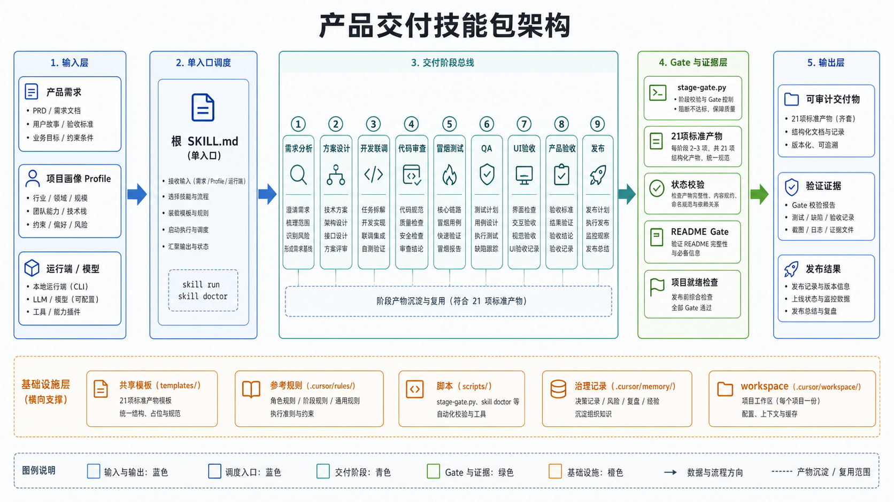

# Product Delivery Skill

<!-- Keywords: product delivery skill, ai agent workflow, requirement to release, Claude Code, Codex, Cursor, OpenClaw, QA gate, UI acceptance, product acceptance, release checklist, open-source README workflow -->

<div align="center">
  
</div>

<div align="center">
  <strong>Move product work from requirement to release-ready delivery with auditable AI Agent gates</strong>
  <br>
  <em>把一个产品需求从目标定义推进到可发布交付：需求、方案、开发、审查、冒烟、QA、UI 验收、产品验收、发布，一条证据链跑到底</em>
  <br><br>
  <code>SKILL.md</code>-format skill for <strong>Claude Code</strong> · <strong>Codex</strong> · <strong>Cursor</strong> · <strong>OpenClaw</strong> — product delivery as a repeatable workflow
  <br>
  <p>流程即交付，证据即完成</p>
  <br>
  <p>⭐ Star it if useful — 如果这个 skill 对你有用，点个 Star 让更多 Agent 开发者发现它</p>
</div>

<div align="center">

<a href="#快速开始">快速开始</a> · <a href="./docs/README_en.md">English</a> · <a href="#工作流总览">工作流</a> · <a href="#系统架构">设计理念</a> · <a href="#常见问题">FAQ</a>

</div>

<div align="center">

[](LICENSE)
[](#版本说明)
[](#项目状态)
[](shared/scripts/)
[](install/)
[](shared/templates/)
[](#快速开始)
[](https://github.com/qierkang/product-delivery-skill/pulls)
[](https://github.com/qierkang/product-delivery-skill/stargazers)

</div>

---



---

## 为什么需要 Product Delivery Skill？

你在用 AI Agent 做产品交付，但真实项目很少只是“写一段代码”这么简单：

- 🧭 “先把需求做了” → **需求口径没收敛**，目标、范围、验收标准混在聊天里，后续很难判断是否偏题
- 🧱 “先写方案再开发” → **方案和实现脱节**，技术方案、任务拆解、自测记录没有形成同一条证据链
- 🔍 “代码已经改完了” → **缺少审查与回归边界**，复杂度、依赖选择、回归风险没有被固定检查
- 🧪 “本地看起来没问题” → **冒烟、QA、UI 验收、产品验收混在一起**，谁放行、放行什么不清楚
- 🚀 “可以发布了” → **发布材料最后才补**，发布记录、回滚策略、README、变更说明容易临时拼凑

**这些问题不是靠更长的聊天能稳定解决，而是需要一套固定阶段、固定产物、固定 Gate 的产品交付流程。**

告诉你的 AI Agent：

```text
使用 product-delivery-skill，把这个需求从 requirement 推进到 release，并保留每个阶段的验证证据。
```

或直接用脚本：

```bash
python3 shared/scripts/init-request.py \
  --request-key my-first-request \
  --workspace workspace/requests

python3 shared/scripts/stage-gate.py \
  --request-dir workspace/requests/my-first-request \
  --stage all
```

| | |
|---|---|
| 🔄 **全链路交付** | 需求、设计、开发、审查、冒烟、QA、UI 验收、产品验收、发布由同一套流程串起来 |
| ✅ **证据化 Gate** | 每个阶段必须留下文件、命令输出或检查结论，不用口头“完成”代替放行 |
| 🧩 **Profile 参数化** | 不同项目的路径、环境、业务约束进入 `profiles/`，不污染通用主流程 |
| 🧰 **模板内置** | 21 项标准交付物模板随 skill 一起提供，避免每次从空白文档开始 |
| 🤖 **多 Agent 兼容** | Claude Code、Codex、Cursor、OpenClaw 等支持 `SKILL.md` 的运行端都能按规则接手 |

---

## 项目概述

`product-delivery-skill` 是一套面向 AI 编程工作流的产品交付技能包。它不绑定单一模型或单一运行端，而是把“需求 → 方案 → 开发 → 审查 → 冒烟 → QA → UI 验收 → 产品验收 → 发布”拆成可执行、可验证、可追溯的阶段；通过 `SKILL.md` 路由、`shared/templates/` 产物模板、`stage-gate.py` 门禁、`profiles/` 项目画像和 `governance/` 治理记录，让 AI Agent 不只会写代码，也能按产品交付标准把工作推进到可发布状态。

> **English summary**: `product-delivery-skill` is a `SKILL.md`-format AI agent workflow for turning product requests into release-ready delivery. It standardizes requirements, design, implementation, review, smoke testing, QA, UI acceptance, product acceptance, release evidence, and README publishing workflows across Claude Code, Codex, Cursor, OpenClaw, and similar agents.
>
> If this saves you time, a ⭐ helps others find it.

## 核心特色

- **九阶段交付链路**：`Requirement → Design → Dev → Review → Smoke → QA → UI Acceptance → Product Acceptance → Release`，后半段验收与发布强顺序放行。
- **证据化 Gate**：`stage-gate.py` 检查阶段产物和状态，缺少日志、测试记录、验收报告或发布材料时不允许跳过。
- **21 项标准产物模板**：需求总览、技术方案、任务分解、实现控制表、QA 报告、UI 验收、产品验收、发布记录等模板内置。
- **Profile 参数化接手**：项目路径、环境、执行模式和业务特例进入 `profiles/`，主流程保持通用、可复用、可审计。
- **开源 README 工作流**：内置 `shared/workflow/open-source-readme.md` 和 `shared/scripts/readme-gate.py`，README 重构、发布说明和门禁校验可以纳入交付链路。

## 与同类方案对比

| 方案 | AI Agent 直接调用 | 阶段 Gate | 交付证据 | Profile 适配 | README 发布门禁 | 多模型协作 |
|------|:---:|:---:|:---:|:---:|:---:|:---:|
| **Product Delivery Skill** | ✅ SKILL.md | ✅ | ✅ | ✅ | ✅ | ✅ |
| 普通聊天式开发 | ✅ 但不稳定 | ❌ | ❌ | ❌ | ❌ | △ |
| 只用任务清单 | △ | △ | ❌ | ❌ | ❌ | △ |
| 只跑测试脚本 | ❌ | △ | ✅ 局部 | ❌ | ❌ | ❌ |
| 手工项目管理文档 | ❌ | △ | ✅ 但分散 | △ | ❌ | △ |

## 工作流总览

| 阶段 | Gate 入口 | 说明 |
|------|------|------|
| 🧭 **需求定义** | `requirement` | 收敛目标、范围、约束、验收标准和业务口径 |
| 🏗️ **技术方案** | `design` | 明确架构、接口、数据、UI 基线、风险和任务拆解 |
| 💻 **开发推进** | `dev` | 落实现、同步控制表、保留自测和关键决策证据 |
| 🔍 **代码审查** | `review` | 检查正确性、安全性、复杂度、依赖选择和回归风险 |
| 🧪 **冒烟验证** | `smoke` | 验证关键路径可运行，保留命令输出或截图证据 |
| ✅ **QA 验收** | `qa` | 汇总测试用例、缺陷、复测结论和开发放行报告 |
| 🎨 **UI 验收** | `ui_acceptance` | 检查视觉、交互、响应式、可访问性和设计一致性 |
| 📦 **产品验收** | `product_acceptance` | 对照业务目标、用户路径和验收标准做最终确认 |
| 🚀 **发布** | `release` | 输出发布记录、回滚方案、变更摘要和最终证据 |

> **不确定从哪个阶段开始？** 先读 `START-HERE.md`，再看 `skills/product-delivery-skill/SKILL.md` 的 Workflow 路由。新需求默认从 `requirement` 进入；README 开源发布走 `shared/workflow/open-source-readme.md`。

---

## 快速开始

### 前置条件

- Claude Code / Codex / Cursor / OpenClaw 等支持 `SKILL.md` 的 AI Agent
- `git`
- `python3`
- Bash 4.0+
- 可选：具体项目所需的 Node、pnpm、Java、Maven、数据库或浏览器自动化环境

### 安装与体检

```bash
git clone https://github.com/qierkang/product-delivery-skill.git
cd product-delivery-skill

bash install/setup.sh
bash install/doctor.sh --capability docs
python3 shared/scripts/health-check.py
```

### 初始化一个交付请求

```bash
python3 shared/scripts/init-request.py \
  --request-key my-first-request \
  --title "我的第一个交付任务" \
  --workspace workspace/requests
```

生成后的 request 目录会承载阶段状态、需求文档、方案、QA、验收和发布证据：

<details>
<summary>查看 request 关键结构</summary>

```text
workspace/requests/my-first-request/
├── request/
│   ├── 需求总览.md
│   ├── 需求文档.md
│   ├── manifest.json
│   └── stage-status.json
├── design/
│   ├── DESIGN.md
│   ├── 技术方案.md
│   ├── UI交互设计规范.md
│   └── 任务分解.md
├── control/
│   ├── 实现控制总表.md
│   └── 页面接口验收总表.md
├── qa/
│   ├── 冒烟测试报告.md
│   ├── QA验收报告.md
│   ├── UI验收报告.md
│   └── 产品验收报告.md
└── release/
    └── 发布记录.md
```

</details>

### 执行阶段 Gate

```bash
# 单阶段 Gate
python3 shared/scripts/stage-gate.py \
  --request-dir workspace/requests/my-first-request \
  --stage requirement

# 全阶段汇总检查
python3 shared/scripts/stage-gate.py \
  --request-dir workspace/requests/my-first-request \
  --stage all
```

## 功能模块

### 交付主流程

- `skills/product-delivery-skill/SKILL.md` 是主流程入口，负责必读顺序、按需规则和 Workflow 路由。
- `shared/workflow/` 提供 `new-feature`、`change-request`、`bugfix`、`growth-campaign`、`new-project`、`open-source-readme` 等工作流。
- `shared/references/quality-gates.md` 统一说明阶段 Gate 和放行边界。
- `START-HERE.md` 给首次接手者提供最短读取路径。

### 标准产物体系

- `shared/templates/` 内置 21 项交付模板，覆盖需求、设计、控制表、QA、验收和发布。
- `shared/templates/README.md` 是模板入口索引。
- `docs/architecture.md` 记录标准产物体系和整体架构。
- `examples/sbti-red-mvp/` 提供一套真实样例，便于检查产物之间如何串联。

### 脚本与门禁

- `shared/scripts/init-request.py` 初始化 request 工作区。
- `shared/scripts/stage-gate.py` 执行单阶段或全阶段 Gate。
- `shared/scripts/project-ready-check.py` 做项目级交付检查。
- `shared/scripts/readme-gate.py` 校验 README 章节、模板残留和基础开源质量。
- `shared/scripts/health-check.py` 校验 skill 自身结构、模板、Profile 和治理记录。

### Profile 与治理

- `profiles/` 收口不同项目的 workspace、docs、执行模式和特殊约束。
- `governance/decisions/` 记录架构与流程决策。
- `governance/updates/` 记录能力演进和健康检查结果。
- `governance/vendor-skills.yaml` 登记外部方法来源、许可证和集成边界。

## 技术栈

| 层级 | 技术 / 资产 | 说明 |
|---|---|---|
| Skill 入口 | `SKILL.md` | 根触发入口和主流程路由 |
| 主流程规则 | `skills/product-delivery-skill/SKILL.md` | 阶段顺序、必读文件、按需规则和标准链路 |
| 方法增强 | `skills/product-delivery-methods/` | 代码精简、复杂度审查和实现质量门禁 |
| 自动化脚本 | Python 3 / Bash | 初始化、体检、阶段 Gate、README gate、健康检查 |
| 产物模板 | Markdown / JSON / Shell | 需求、设计、QA、验收、发布等标准交付物 |
| 项目画像 | YAML / Markdown | 多项目 profile 和环境参数 |
| 视觉资产 | `image_gen` + PNG | README 架构图和中英文图像资产 |
| README 校验 | `shared/scripts/readme-gate.py` / `~/.claude/scripts/readme-gate.py` | 结构完整性、模板残留和展示质量检查 |

---

## 系统架构

### 工作流设计

```text
User Request
    ↓
Root SKILL.md（识别交付任务 / README 发布 / 方法增强）
    ↓
skills/product-delivery-skill/SKILL.md
    ↓
┌──────────────────────────────────────────────────────────────┐
│ Requirement → Design → Dev → Review → Smoke → QA             │
│       ↓                                                       │
│ UI Acceptance → Product Acceptance → Release                  │
└──────────────────────────────────────────────────────────────┘
    ↓
Evidence Layer
templates · scripts · profiles · governance · README gate
```

### 架构说明

- 根 `SKILL.md` 只做轻量路由，真实交付入口在 `skills/product-delivery-skill/SKILL.md`。
- 交付过程按阶段推进，不允许跳过 Gate 直接宣称完成。
- 项目差异进入 `profiles/`，通用交付规则留在 `shared/` 和 `skills/`。
- 编码效率增强只在 Dev / Review 阶段生效，不替代需求、方案、QA 或发布流程。
- README 开源发布是独立 workflow，可作为产品交付的发布准备环节纳入验证链路。

---

## 目录结构

```text
product-delivery-skill/
├── SKILL.md                              # 根入口与路由说明
├── START-HERE.md                         # 首次接手导航
├── README.md                             # 中文默认 README
├── docs/
│   ├── README_en.md                      # 英文 README
│   ├── architecture.md                   # 架构与产物体系
│   ├── profiles.md                       # Profile 说明
│   └── readme-spec.md                    # README 生成与发布流程
├── assets/
│   ├── asset-manifest.json               # 图片资产登记
│   └── platform/architecture/{zh-CN,en}/ # 中英文架构图
├── skills/
│   ├── product-delivery-skill/           # 主交付流程
│   └── product-delivery-methods/         # 方法增强
├── shared/
│   ├── templates/                        # 21 项标准产物模板
│   ├── workflow/                         # 任务类型工作流
│   ├── references/                       # 通用规则
│   └── scripts/                          # 自动化脚本
├── profiles/                             # 项目画像
├── examples/                             # 示例与历史运行
├── governance/                           # 决策、变更和健康检查
└── install/                              # setup / doctor / sync
```

---

## 命令参考

| 命令 | 说明 |
|------|------|
| `bash install/setup.sh` | 初始化本机运行环境 |
| `bash install/doctor.sh --capability docs` | 检查文档能力是否可用 |
| `python3 shared/scripts/health-check.py` | 校验 skill 自身结构、模板、Profile、治理记录 |
| `python3 shared/scripts/init-request.py --request-key <key> --workspace <dir>` | 初始化一个交付 request |
| `python3 shared/scripts/stage-gate.py --request-dir <dir> --stage <stage>` | 执行单阶段或全阶段 Gate |
| `python3 shared/scripts/project-ready-check.py --project-dir <dir>` | 项目级交付准备检查 |
| `python3 shared/scripts/readme-gate.py --readme README.md` | README 开源结构校验 |
| `bash install/sync.sh` | 同步到支持的运行端 |

---

## 开发指南

### 修改主交付流程

改阶段顺序、必读规则或 Workflow 路由时，优先修改 `skills/product-delivery-skill/SKILL.md`，并同步相关 `shared/workflow/` 或 `shared/references/`。

### 新增或调整模板

模板变化必须同步检查 `shared/templates/README.md`、`docs/architecture.md` 和 `stage-gate.py` 的检查口径，避免模板存在但 Gate 不识别。

### 修改脚本

脚本修改后至少运行：

```bash
python3 -m py_compile shared/scripts/*.py
bash install/doctor.sh --capability docs
python3 shared/scripts/health-check.py
```

### 新增 Profile

新增 `profiles/<name>/profile.yaml` 时，同目录必须有 `README.md`，并说明 workspace、docs、执行模式、风险边界和适用场景。

### README 重构

README 改写走 `shared/workflow/open-source-readme.md`，改完必须跑：

```bash
python3 shared/scripts/readme-gate.py --readme README.md
~/.claude/scripts/readme-gate.py --readme README.md
```

---

## 开发与验证

### 验证步骤（按顺序执行）

```bash
# 1. 安装与文档能力检查
bash install/doctor.sh --capability docs

# 2. Python 脚本基本语法检查
python3 -m py_compile shared/scripts/*.py

# 3. skill 自检
python3 shared/scripts/health-check.py

# 4. README gate
python3 shared/scripts/readme-gate.py --readme README.md
~/.claude/scripts/readme-gate.py --readme README.md

# 5. 若存在 README 图片，校验 asset manifest
../platform-project-skill/scripts/verify-assets.sh .
```

### 验证要求

- `health-check.py` 不得出现 FAIL。
- README gate 必须 `pass=true`。
- 展示图必须是直接 Markdown 图片语法，不能放进 fenced code block。
- 公开发布前必须处理真实密钥、`.env`、客户数据、本机绝对路径和未验证的公开链接。

---

## 项目状态

- 当前状态：`已公开发布到 GitHub，本地验证通过`
- 版本阶段：`v0.2.0 · Public GitHub`
- 维护方式：随本地 AI 交付流程持续迭代
- 兼容范围：`macOS / Linux · Python 3 · Bash · Claude Code / Codex / Cursor / OpenClaw`
- 托管状态：公开 GitHub 仓库 `https://github.com/qierkang/product-delivery-skill`
- GitHub 状态：`master` 已推送到公开仓库
- 已知风险：示例 Profile 使用样例 workspace 路径，实际项目执行前需要替换为真实路径

---

## 在线演示 / 效果预览

本项目是本地技能包，不提供常驻在线演示。效果预览以本页架构图、[examples/sbti-red-mvp/](./examples/sbti-red-mvp/)、`stage-gate.py` 输出和 README gate 输出为准。

---

## 常见问题

<details>
<summary><strong>这个 skill 是替代项目管理工具吗？</strong></summary>

不是。它更像 AI Agent 的交付操作规程：把需求、方案、开发、审查、测试、验收、发布这些动作固化为阶段和证据。团队仍然可以继续使用 Jira、飞书、GitHub Issues 或其他项目管理工具。
</details>

<details>
<summary><strong>可以从 dev 阶段直接开始吗？</strong></summary>

可以按任务实际情况进入某个阶段，但不能伪造前置证据。若需求和方案已经存在，先把证据落到 request 目录，再运行对应 Gate；没有证据时不应直接宣称已通过。
</details>

<details>
<summary><strong>外部 UI skill 不可用怎么办？</strong></summary>

使用 `shared/references/design-baseline.md`。主流程明确禁止把普通 `frontend-design` 一类泛化 skill 当成 `ui-ux-pro-max` 的默认替代，最终必须回到本仓模板和 Gate。
</details>

<details>
<summary><strong>README 怎么算重构完成？</strong></summary>

至少通过两类 gate：

```bash
python3 shared/scripts/readme-gate.py --readme README.md
~/.claude/scripts/readme-gate.py --readme README.md
```

如果 README 引用了图片，还要确认图片路径存在并登记到 `assets/asset-manifest.json`。
</details>

<details>
<summary><strong>它会自动发布到 GitHub 吗？</strong></summary>

不会。发布、推送、公开提交、创建 release 都属于外部动作，必须由用户明确确认后再执行。
</details>

---

## 贡献与协作

欢迎提交 Issue、功能建议和文档改进。贡献前建议先跑完整本地验证。

**如何参与：**

1. **报告 Bug**：附上触发任务、request 目录结构、`stage-gate.py` 输出和最小复现步骤。
2. **新增工作流**：先说明任务类型、阶段边界、必需产物和 Gate 条件，再补 `shared/workflow/`。
3. **修改脚本**：必须通过 `python3 -m py_compile shared/scripts/*.py` 和 `python3 shared/scripts/health-check.py`。
4. **修改 README**：必须通过本仓 `readme-gate.py` 和全局 `~/.claude/scripts/readme-gate.py`。

完整贡献说明见 [CONTRIBUTING.md](./CONTRIBUTING.md)。English contributors are welcome; see [docs/README_en.md](./docs/README_en.md).

---

## 测试与构建

本仓库不产出编译包。测试重点是脚本可运行、模板齐全、Profile 可读、README gate 通过、资产 manifest 与 README 图片引用一致。

```bash
bash install/doctor.sh --capability docs
python3 -m py_compile shared/scripts/*.py
python3 shared/scripts/health-check.py
python3 shared/scripts/readme-gate.py --readme README.md
```

## 部署说明

这是可复制的技能包，不运行常驻服务。通过 `install/setup.sh` 初始化本机环境，通过 `install/sync.sh` 同步到支持的运行端；公开发布前先完成敏感路径、噪音文件、README 图片和开源社区文件检查。

## Roadmap

- [ ] 补齐 GitHub CI、Issue 模板和公开发布元信息
- [ ] 将历史 Profile 中的本机路径改为环境变量或示例值
- [ ] 增加跨平台安装回归和英文 README 同步检查

## 安全说明

不要提交真实凭据、`.env`、客户数据或私有环境路径。公开发布前应扫描历史样例、Profile、升级报告和 README，确认没有敏感信息、内部客户名称或本机绝对路径泄漏。

---

## 版本说明

| 版本 | 状态 | 变更摘要 |
|------|------|---------|
| `v0.2.0` | 当前 | 生产级整改、独立 Git 托管、主入口瘦身、Profile 索引、健康检查、README 工作流 |
| `2026-04-21` | 归档 | 新增开源 README 参考、工作流和 `readme-gate.py` |
| `2026-04-12` | 归档 | 新增 UI 设计兜底规则和 Claude 入口约束 |
| `2026-04-11` | 归档 | 初始化 skill 骨架和 `sbti-red` 试点 profile |

> 完整变更历史见 [CHANGELOG.md](./CHANGELOG.md) 和 [governance/CHANGELOG.md](./governance/CHANGELOG.md)。

---

## 致谢

本项目的工作流设计和工程实践受以下工具与项目启发：

[Claude Code](https://www.anthropic.com/claude-code) · [OpenAI Codex](https://openai.com/codex/) · [Cursor](https://cursor.com/) · [OpenClaw](https://github.com/Panniantong/OpenClaw) · [Ponytail](https://github.com/DietrichGebert/ponytail)

---

## Star History · Star 历史

如果这个 skill 对你有帮助，欢迎点亮一颗 Star ⭐ —— If this skill helps you, please consider giving it a star.

[](https://www.star-history.com/#qierkang/product-delivery-skill&Date)

---

## 许可证

MIT License © 2026 [qierkang](https://github.com/qierkang)

---

## 维护者

- **Email**：xyqierkang@gmail.com
- **GitHub**：[github.com/qierkang](https://github.com/qierkang)
