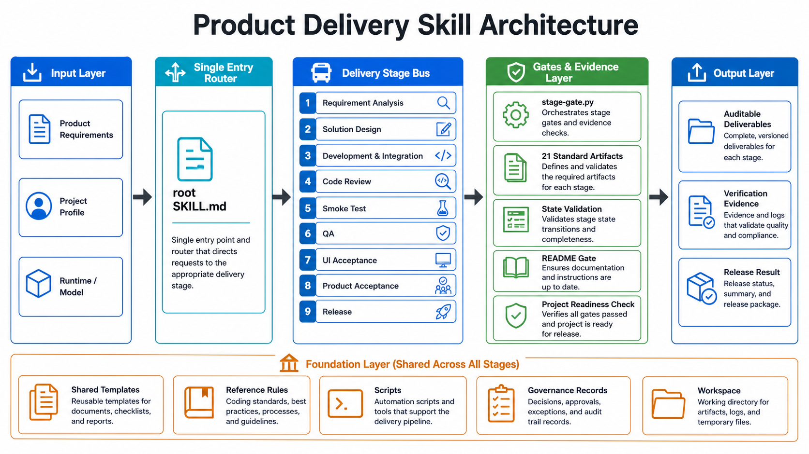

# Product Delivery Skill

<!-- Keywords: product delivery skill, AI agent workflow, requirement to release, Claude Code, Codex, Cursor, OpenClaw, QA gate, UI acceptance, product acceptance, release checklist, open-source README workflow -->

<div align="center">
  
</div>

<div align="center">
  <strong>Move product work from requirement to release-ready delivery with auditable AI Agent gates</strong>
  <br>
  <em>Turn a product request into release-ready delivery: requirements, design, implementation, review, smoke testing, QA, UI acceptance, product acceptance, release, and evidence in one workflow.</em>
  <br><br>
  <code>SKILL.md</code>-format skill for <strong>Claude Code</strong> · <strong>Codex</strong> · <strong>Cursor</strong> · <strong>OpenClaw</strong> — product delivery as a repeatable workflow
  <br>
  <p>Process is delivery. Evidence is completion.</p>
  <br>
  <p>⭐ Star it if useful — it helps more AI agent builders find the workflow.</p>
</div>

<div align="center">

<a href="#quick-start">Quick Start</a> · <a href="../README.md">简体中文</a> · <a href="#workflow-overview">Workflow</a> · <a href="#system-architecture">Design</a> · <a href="#faq">FAQ</a>

</div>

<div align="center">

[](../LICENSE)
[](#version-history)
[](#project-status)
[](../shared/scripts/)
[](../install/)
[](../shared/templates/)
[](#quick-start)
[](https://github.com/qierkang/product-delivery-skill/pulls)
[](https://github.com/qierkang/product-delivery-skill/stargazers)

</div>

---



---

## Why Product Delivery Skill?

AI agents can write code quickly, but real product delivery needs more than a patch:

- "Just build the feature" -> **unclear requirements**, with goals, scope, constraints, and acceptance criteria scattered across chat.
- "Write the design first" -> **design and implementation drift**, because task breakdown, technical decisions, and self-test evidence are not tied together.
- "The code is done" -> **missing review boundaries**, with complexity, dependency choices, and regression risks left unchecked.
- "It works locally" -> **smoke, QA, UI acceptance, and product acceptance mixed together**, making release ownership unclear.
- "Ship it" -> **release material created too late**, including changelog, rollback notes, README updates, and validation evidence.

**Product delivery becomes reliable when the AI agent follows fixed stages, fixed artifacts, and fixed gates instead of relying on long conversations.**

Tell your AI agent:

```text
Use product-delivery-skill to move this request from requirement to release, and keep validation evidence for every stage.
```

Or run the scripts directly:

```bash
python3 shared/scripts/init-request.py \
  --request-key my-first-request \
  --workspace workspace/requests

python3 shared/scripts/stage-gate.py \
  --request-dir workspace/requests/my-first-request \
  --stage all
```

| | |
|---|---|
| Full delivery chain | Requirements, design, implementation, review, smoke testing, QA, UI acceptance, product acceptance, and release share one workflow. |
| Evidence-based gates | Each stage must leave files, command output, or validation notes instead of verbal completion claims. |
| Profile-based adaptation | Project-specific paths, environments, and business constraints live in `profiles/`, keeping the core workflow reusable. |
| Built-in templates | 21 standard delivery artifact templates prevent every request from starting with a blank document. |
| Multi-agent compatible | Any runtime that can read `SKILL.md` can follow the same process: Claude Code, Codex, Cursor, OpenClaw, and similar agents. |

---

## Project Overview

`product-delivery-skill` is an AI-agent workflow package for turning product requests into release-ready delivery. It is model-agnostic and runtime-agnostic: the project decomposes "requirement -> design -> implementation -> review -> smoke -> QA -> UI acceptance -> product acceptance -> release" into executable and auditable stages. With `SKILL.md` routing, `shared/templates/` artifacts, `stage-gate.py` checks, `profiles/` project configuration, and `governance/` records, an agent can move beyond coding and operate inside a product delivery discipline.

> **中文摘要**：`product-delivery-skill` 是一套 `SKILL.md` 格式的 AI Agent 产品交付流程，把需求、方案、开发、审查、冒烟、QA、UI 验收、产品验收、发布和 README 开源发布收口为可执行、可验证、可追溯的证据链。
>
> If this saves you time, a ⭐ helps others find it.

## Core Features

- **Nine-stage delivery chain**: `Requirement -> Design -> Dev -> Review -> Smoke -> QA -> UI Acceptance -> Product Acceptance -> Release`, with strict ordering for acceptance and release.
- **Evidence-based gates**: `stage-gate.py` checks stage artifacts and status files; missing logs, validation records, acceptance reports, or release material block completion.
- **21 standard artifact templates**: requirement overview, technical design, task breakdown, implementation control, QA report, UI acceptance, product acceptance, release record, and more.
- **Profile-based handoff**: project paths, execution modes, business constraints, and special cases stay in `profiles/`, while the main workflow remains reusable.
- **Open-source README workflow**: `shared/workflow/open-source-readme.md` and `shared/scripts/readme-gate.py` make README rewrites and publication checks part of delivery.

## Comparison

| Approach | Agent-callable | Stage Gates | Delivery Evidence | Profile Adaptation | README Publication Gate | Multi-agent Workflow |
|---|:---:|:---:|:---:|:---:|:---:|:---:|
| **Product Delivery Skill** | Yes, via `SKILL.md` | Yes | Yes | Yes | Yes | Yes |
| Chat-only development | Partly | No | No | No | No | Partial |
| Plain task checklist | Partial | Partial | No | No | No | Partial |
| Test scripts only | No | Partial | Local only | No | No | No |
| Manual project docs | No | Partial | Yes, but scattered | Partial | No | Partial |

## Workflow Overview

| Stage | Gate Key | What It Controls |
|---|---|---|
| Requirement | `requirement` | Goal, scope, constraints, acceptance criteria, and business wording. |
| Design | `design` | Architecture, APIs, data, UI baseline, risks, and task breakdown. |
| Dev | `dev` | Implementation, control table updates, self-test evidence, and decisions. |
| Review | `review` | Correctness, security, complexity, dependency choices, and regression risks. |
| Smoke | `smoke` | Critical path execution with command output or screenshot evidence. |
| QA | `qa` | Test cases, defects, retest results, and development release report. |
| UI Acceptance | `ui_acceptance` | Visual consistency, interaction behavior, responsive layout, and accessibility. |
| Product Acceptance | `product_acceptance` | Business goals, user flows, and final acceptance criteria. |
| Release | `release` | Release record, rollback notes, change summary, and final evidence. |

> Not sure where to start? Read [START-HERE.md](../START-HERE.md), then follow the routing table in [skills/product-delivery-skill/SKILL.md](../skills/product-delivery-skill/SKILL.md). New feature work starts at `requirement`; public README work follows [shared/workflow/open-source-readme.md](../shared/workflow/open-source-readme.md).

---

## Quick Start

### Prerequisites

- An AI agent runtime that can read `SKILL.md`, such as Claude Code, Codex, Cursor, or OpenClaw.
- `git`
- `python3`
- Bash 4.0+
- Optional project-specific tooling: Node, pnpm, Java, Maven, database services, or browser automation.

### Install And Check

```bash
git clone https://github.com/qierkang/product-delivery-skill.git
cd product-delivery-skill

bash install/setup.sh
bash install/doctor.sh --capability docs
python3 shared/scripts/health-check.py
```

### Initialize A Delivery Request

```bash
python3 shared/scripts/init-request.py \
  --request-key my-first-request \
  --title "My first delivery request" \
  --workspace workspace/requests
```

The generated request directory keeps stage status, requirement docs, design docs, QA evidence, acceptance records, and release material:

<details>
<summary>Request structure</summary>

```text
workspace/requests/my-first-request/
├── request/
│   ├── 需求总览.md
│   ├── 需求文档.md
│   ├── manifest.json
│   └── stage-status.json
├── design/
│   ├── DESIGN.md
│   ├── 技术方案.md
│   ├── UI交互设计规范.md
│   └── 任务分解.md
├── control/
│   ├── 实现控制总表.md
│   └── 页面接口验收总表.md
├── qa/
│   ├── 冒烟测试报告.md
│   ├── QA验收报告.md
│   ├── UI验收报告.md
│   └── 产品验收报告.md
└── release/
    └── 发布记录.md
```

</details>

### Run Stage Gates

```bash
# Single-stage gate
python3 shared/scripts/stage-gate.py \
  --request-dir workspace/requests/my-first-request \
  --stage requirement

# Full-stage summary check
python3 shared/scripts/stage-gate.py \
  --request-dir workspace/requests/my-first-request \
  --stage all
```

## Modules

### Main Delivery Workflow

- `skills/product-delivery-skill/SKILL.md` is the main workflow entry, defining required reads, conditional rules, and workflow routing.
- `shared/workflow/` contains routes for `new-feature`, `change-request`, `bugfix`, `growth-campaign`, `new-project`, and `open-source-readme`.
- `shared/references/quality-gates.md` explains stage gates and release boundaries.
- `START-HERE.md` provides the shortest onboarding path for a new agent.

### Standard Artifact System

- `shared/templates/` provides 21 delivery templates covering requirements, design, control tables, QA, acceptance, and release.
- `shared/templates/README.md` indexes the template set.
- `docs/architecture.md` documents the artifact model and architecture.
- `examples/sbti-red-mvp/` shows how a real request connects artifacts across stages.

### Scripts And Gates

- `shared/scripts/init-request.py` initializes a request workspace.
- `shared/scripts/stage-gate.py` runs one stage gate or the full delivery gate summary.
- `shared/scripts/project-ready-check.py` checks project-level release readiness.
- `shared/scripts/readme-gate.py` validates README sections, template residue, and open-source readiness.
- `shared/scripts/health-check.py` validates this skill package: structure, templates, profiles, and governance records.

### Profiles And Governance

- `profiles/` captures project-specific workspaces, docs paths, modes, and boundaries.
- `governance/decisions/` records architecture and workflow decisions.
- `governance/updates/` records capability changes and health-check results.
- `governance/vendor-skills.yaml` tracks external method sources, licenses, and integration boundaries.

## Tech Stack

| Layer | Technology / Asset | Purpose |
|---|---|---|
| Skill entry | `SKILL.md` | Root trigger and routing file. |
| Main workflow | `skills/product-delivery-skill/SKILL.md` | Stage order, required reads, conditional rules, and standard delivery path. |
| Method extension | `skills/product-delivery-methods/` | Code simplicity, complexity review, and implementation quality gates. |
| Automation | Python 3 / Bash | Setup, doctor, request initialization, stage gates, README gate, and health check. |
| Templates | Markdown / JSON / Shell | Standard artifacts for requirements, design, QA, acceptance, and release. |
| Profiles | YAML / Markdown | Project configuration and environment parameters. |
| Visual assets | `image_gen` + PNG | README architecture diagrams and localized image assets. |
| README validation | `shared/scripts/readme-gate.py` / `~/.claude/scripts/readme-gate.py` | Structure, template residue, and publication-quality checks. |

---

## System Architecture

### Workflow Design

```text
User Request
    ↓
Root SKILL.md
    ↓
skills/product-delivery-skill/SKILL.md
    ↓
┌──────────────────────────────────────────────────────────────┐
│ Requirement -> Design -> Dev -> Review -> Smoke -> QA        │
│       ↓                                                      │
│ UI Acceptance -> Product Acceptance -> Release               │
└──────────────────────────────────────────────────────────────┘
    ↓
Evidence Layer
templates · scripts · profiles · governance · README gate
```

### Architecture Notes

- The root `SKILL.md` stays light and only routes work; the real delivery workflow lives in `skills/product-delivery-skill/SKILL.md`.
- Work advances by stage; a missing gate means the agent cannot claim completion.
- Project-specific differences belong in `profiles/`; reusable delivery rules belong in `shared/` and `skills/`.
- Code-simplicity methods only affect Dev / Review; they do not replace requirements, design, QA, or release gates.
- Public README publication is a separate workflow and can be treated as a release-readiness step.

---

## Repository Layout

```text
product-delivery-skill/
├── SKILL.md                              # Root entry and routing
├── START-HERE.md                         # First-read onboarding
├── README.md                             # Default Simplified Chinese README
├── docs/
│   ├── README_en.md                      # English README
│   ├── architecture.md                   # Architecture and artifact system
│   ├── profiles.md                       # Profile guide
│   └── readme-spec.md                    # README generation and publication workflow
├── assets/
│   ├── asset-manifest.json               # Image asset registry
│   └── platform/architecture/{zh-CN,en}/ # Localized architecture diagrams
├── skills/
│   ├── product-delivery-skill/           # Main delivery workflow
│   └── product-delivery-methods/         # Method extensions
├── shared/
│   ├── templates/                        # 21 standard artifacts
│   ├── workflow/                         # Task-type workflows
│   ├── references/                       # Shared rules
│   └── scripts/                          # Automation scripts
├── profiles/                             # Project profiles
├── examples/                             # Examples and historical runs
├── governance/                           # Decisions, updates, and health checks
└── install/                              # setup / doctor / sync
```

---

## Command Reference

| Command | Purpose |
|---|---|
| `bash install/setup.sh` | Initialize local runtime files. |
| `bash install/doctor.sh --capability docs` | Check documentation capability. |
| `python3 shared/scripts/health-check.py` | Validate skill structure, templates, profiles, and governance records. |
| `python3 shared/scripts/init-request.py --request-key <key> --workspace <dir>` | Initialize a delivery request. |
| `python3 shared/scripts/stage-gate.py --request-dir <dir> --stage <stage>` | Run one stage gate or all gates. |
| `python3 shared/scripts/project-ready-check.py --project-dir <dir>` | Check project-level delivery readiness. |
| `python3 shared/scripts/readme-gate.py --readme README.md` | Validate open-source README structure. |
| `bash install/sync.sh` | Sync into supported agent runtimes. |

---

## Development Guide

### Modify The Main Workflow

When changing stage order, required reads, or workflow routing, update `skills/product-delivery-skill/SKILL.md` first, then sync related `shared/workflow/` and `shared/references/` files.

### Add Or Adjust Templates

Template changes must be reflected in `shared/templates/README.md`, `docs/architecture.md`, and `stage-gate.py`; otherwise the repository may contain templates that the gate does not recognize.

### Modify Scripts

After script changes, run at least:

```bash
python3 -m py_compile shared/scripts/*.py
bash install/doctor.sh --capability docs
python3 shared/scripts/health-check.py
```

### Add A Profile

Each new `profiles/<name>/profile.yaml` must have a sibling `README.md` describing workspace paths, docs paths, execution modes, risk boundaries, and use cases.

### Rewrite README Files

README work follows `shared/workflow/open-source-readme.md`. After changes, run:

```bash
python3 shared/scripts/readme-gate.py --readme README.md
~/.claude/scripts/readme-gate.py --readme README.md
```

---

## Development And Validation

### Validation Steps

```bash
# 1. Install and documentation capability check
bash install/doctor.sh --capability docs

# 2. Python syntax check
python3 -m py_compile shared/scripts/*.py

# 3. Skill health check
python3 shared/scripts/health-check.py

# 4. README gates
python3 shared/scripts/readme-gate.py --readme README.md
~/.claude/scripts/readme-gate.py --readme README.md

# 5. Asset manifest check when README images exist
../platform-project-skill/scripts/verify-assets.sh .
```

### Pass Criteria

- `health-check.py` has no `FAIL`.
- README gate returns `pass=true`.
- Display images use direct Markdown image syntax, not fenced code blocks.
- Before public release, remove real secrets, `.env` files, customer data, local absolute paths, and unverified public links.

---

## Project Status

- Current status: `Published on GitHub and locally validated`
- Version stage: `v0.2.0 · Public GitHub`
- Maintenance mode: Iterated with the local AI delivery workflow.
- Compatibility: `macOS / Linux · Python 3 · Bash · Claude Code / Codex / Cursor / OpenClaw`
- Hosting: Public GitHub repository at `https://github.com/qierkang/product-delivery-skill`
- Known risk: Example profiles use sample workspace paths; replace them before running project-specific delivery work.

---

## Demo / Preview

This project is a local skill package and does not run a hosted demo service. Preview the workflow through the architecture diagram on this page, [examples/sbti-red-mvp/](../examples/sbti-red-mvp/), `stage-gate.py` output, and README gate output.

---

## FAQ

<details>
<summary><strong>Does this replace project management tools?</strong></summary>

No. It is closer to an operating procedure for AI agents: it turns requirements, design, implementation, review, testing, acceptance, and release into stages and evidence. Teams can still use Jira, Feishu, GitHub Issues, or other project management systems.
</details>

<details>
<summary><strong>Can I start from the dev stage?</strong></summary>

Yes, if earlier evidence already exists. Put existing requirement and design evidence into the request directory first, then run the relevant gate. Without evidence, the agent should not claim that previous stages passed.
</details>

<details>
<summary><strong>What if an external UI skill is unavailable?</strong></summary>

Use `shared/references/design-baseline.md`. The main workflow explicitly avoids treating generic frontend-design skills as the default fallback for `ui-ux-pro-max`; final work must return to this repository's templates and gates.
</details>

<details>
<summary><strong>When is README work complete?</strong></summary>

At minimum, both README gates must pass:

```bash
python3 shared/scripts/readme-gate.py --readme README.md
~/.claude/scripts/readme-gate.py --readme README.md
```

If the README references images, image paths must exist and generated assets must be recorded in `assets/asset-manifest.json`.
</details>

<details>
<summary><strong>Does the skill publish to GitHub automatically?</strong></summary>

No. Publishing, pushing, creating releases, and changing remote resources are external actions and require explicit user confirmation.
</details>

---

## Contributing

Issues, feature proposals, documentation fixes, and workflow improvements are welcome.

1. **Report bugs**: include the triggering request, request directory structure, `stage-gate.py` output, and minimal reproduction steps.
2. **Add workflows**: describe the task type, stage boundaries, required artifacts, and gate conditions before adding files under `shared/workflow/`.
3. **Modify scripts**: run `python3 -m py_compile shared/scripts/*.py` and `python3 shared/scripts/health-check.py`.
4. **Modify README files**: run the repository README gate and the global `~/.claude/scripts/readme-gate.py`.

See [CONTRIBUTING.md](../CONTRIBUTING.md). Chinese contributors can use the default [README.md](../README.md).

---

## Testing And Build

This repository does not build a package or run a long-lived service. Testing focuses on executable scripts, complete templates, readable profiles, README gates, and asset manifest consistency.

```bash
bash install/doctor.sh --capability docs
python3 -m py_compile shared/scripts/*.py
python3 shared/scripts/health-check.py
python3 shared/scripts/readme-gate.py --readme README.md
```

## Deployment

This is a copyable skill package, not a deployed service. Use `install/setup.sh` to initialize a local environment and `install/sync.sh` to sync into supported runtimes. Before public release, check sensitive paths, generated noise, README images, and open-source community files.

## Roadmap

- [ ] Add GitHub CI and issue templates.
- [ ] Add a checker that keeps Chinese and English README structures aligned.
- [ ] Add cross-platform installation regression checks.
- [ ] Expand English examples for non-Chinese contributors.

## Security

Do not commit real credentials, `.env` files, customer data, or private environment paths. Before publishing, scan examples, profiles, upgrade reports, and README files for secrets, internal customer names, and local absolute paths.

---

## Version History

| Version | Status | Summary |
|---|---|---|
| `v0.2.0` | Current | Production hardening, independent Git hosting, slim skill entry, profile index, health check, and README workflow. |
| `2026-04-21` | Archived | Added open-source README references, workflow, and `readme-gate.py`. |
| `2026-04-12` | Archived | Added UI design fallback rules and Claude entry constraints. |
| `2026-04-11` | Archived | Initialized the skill skeleton and the `sbti-red` pilot profile. |

> Full history: [CHANGELOG.md](../CHANGELOG.md) and [governance/CHANGELOG.md](../governance/CHANGELOG.md).

---

## Acknowledgements

This workflow is informed by practical AI-agent delivery work and inspired by:

[Claude Code](https://www.anthropic.com/claude-code) · [OpenAI Codex](https://openai.com/codex/) · [Cursor](https://cursor.com/) · [OpenClaw](https://github.com/Panniantong/OpenClaw) · [Ponytail](https://github.com/DietrichGebert/ponytail)

---

## Star History

If this skill helps your delivery workflow, please consider starring the repository.

[](https://www.star-history.com/#qierkang/product-delivery-skill&Date)

---

## License

MIT License © 2026 [qierkang](https://github.com/qierkang)

---

## Maintainer

- **Email**: xyqierkang@gmail.com
- **GitHub**: [github.com/qierkang](https://github.com/qierkang)
